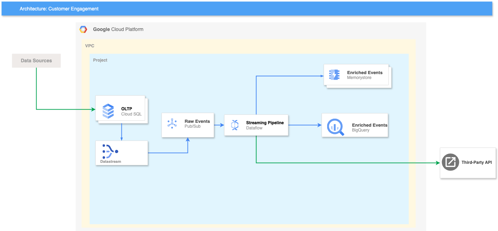

# Customer Engagement Pipeline

A real-time Change Data Capture (CDC) streaming pipeline that enriches engagement events with content metadata using PostgreSQL, Debezium Server, Google Cloud Pub/Sub Emulator, Apache Beam, BigQuery, and third-party API integration.

## Architecture


**Data Flow:**
```
PostgreSQL (CDC) → Debezium Server → Pub/Sub → Apache Beam → Redis + BigQuery + Third-Party API
    ↓                                                             ↑
Data Generator                                              Enriched Events
```

### Components

- **PostgreSQL**: Source database with logical replication enabled
- **Debezium Server**: Captures database changes and publishes to Pub/Sub
- **Pub/Sub Emulator**: Local Google Cloud Pub/Sub for development
- **Apache Beam**: Streaming pipeline for real-time event enrichment
- **Redis**: High-speed storage for enriched events with TTL
- **BigQuery**: Data warehouse for analytics and long-term storage
- **Third-Party API**: FastAPI simulation service for external integrations
- **Data Generator**: Utility for generating test data

## Quick Start

### Prerequisites

- Docker & Docker Compose
- Python 3.11+ (for local data generation)

### 1. Setup Environment and Start Infrastructure

```bash
# Clone and navigate to project
git clone <repository-url>
cd customer-engagement-pipeline

# Setup environment variables
cp environment.env .env

# Start all services
docker compose up --build
```

This will automatically:
- Start PostgreSQL with CDC enabled
- Launch Pub/Sub emulator
- Set up topics and subscriptions (via init container)
- Start Debezium Server for CDC
- Launch the Apache Beam streaming pipeline
- Start Redis for high-speed data storage
- Start BigQuery integration (requires GCP credentials)
- Launch third-party API simulator

### 2. Generate Test Data

```bash
# Install Python dependencies for data generator
pip install faker psycopg2-binary

# Generate sample data
python3 data_generator.py --content 10 --engagement 100 --duration 60
```

### 3. Monitor the Pipeline

```bash
# View pipeline logs
docker compose logs -f beam-pipeline

# Check Redis data
docker exec redis redis-cli dbsize
docker exec redis redis-cli keys "eng:*"

# View enriched events in Redis
docker exec redis redis-cli get "eng:{content-id}:123"

# Check third-party API logs
docker compose logs -f third-party-api

# Monitor BigQuery integration (if configured)
# View enriched events in BigQuery console or using bq CLI
```

## Project Structure

```
customer-engagement-pipeline/
├── docker-compose.yaml           # Infrastructure orchestration
├── environment.env              # Environment variables template
├── seed.sql                     # Database schema
├── data_generator.py            # Test data generation utility
├── conf/
│   └── application.properties   # Debezium configuration
├── setup_pubsub/
│   ├── Dockerfile              # Pub/Sub setup init container
│   └── setup_pubsub.py         # Automated topic/subscription setup
├── bigquery/
│   ├── create_table.sql        # BigQuery table creation script
│   ├── enriched_events_schema.json # BigQuery schema definition
│   ├── insights.sql            # Sample analytical queries
│   └── README.md              # BigQuery setup documentation
├── third-party-api/
│   ├── Dockerfile              # FastAPI container
│   ├── main.py                # FastAPI application
│   └── requirements.txt        # API dependencies
└── pipeline/
    ├── Dockerfile              # Beam pipeline container
    ├── requirements.txt        # Python dependencies
    ├── config.py              # Configuration settings
    ├── streaming_new.py       # Main pipeline (refactored)
    ├── transforms/            # Apache Beam transforms
    │   ├── enrichment.py      # Stateful enrichment logic
    │   ├── redis_writer.py    # Redis output transform
    │   ├── http_sender.py     # Third-party API integration
    │   └── cache_logger.py    # Cache size logging
    └── utils/
        └── helpers.py         # Parsing and formatting utilities
```

## Configuration

### Environment Variables (environment.env)

Copy `environment.env` to `.env` and customize as needed:

```bash
# PostgreSQL Configuration
POSTGRES_USER=debezium
POSTGRES_PASSWORD=dbz
POSTGRES_DB=users_data
POSTGRES_PORT=5432

# Pub/Sub Emulator Configuration
PUBSUB_PROJECT_ID=streaming-project
PUBSUB_HOST=0.0.0.0
PUBSUB_PORT=8085

# Debezium Configuration
DEBEZIUM_LOGGING=INFO

# Pipeline Configuration
DEFAULT_EMIT_INTERVAL_SECS=3

# BigQuery Configuration
BIGQUERY_PROJECT=dev-data-infra
BIGQUERY_DATASET=engagement_analytics
BIGQUERY_TABLE=enriched_events

# Redis Configuration
REDIS_HOST=redis
REDIS_PORT=6379

# Third-party API Configuration
THIRD_PARTY_API_URL=http://third-party-api:8080
THIRD_PARTY_API_PORT=8080
```

### Pipeline Configuration

Key settings in `pipeline/config.py`:

- **Database connection**: Auto-configured for Docker networking
- **Redis settings**: TTL (3600 seconds), connection parameters
- **Pub/Sub emulator**: Automatic host detection
- **Window timing**: 3-second emission intervals (configurable)
- **BigQuery integration**: Streaming inserts with schema validation
- **Third-party API**: HTTP timeout and retry configuration

## Pipeline Features

### Real-time Event Enrichment

The pipeline enriches engagement events with content metadata and derived fields:

**Content Metadata (from database):**
```json
{
  "id": "550e8400-e29b-41d4-a716-446655440000",
  "slug": "intro-to-apache-beam",
  "title": "Introduction to Apache Beam for Streaming Analytics",
  "content_type": "podcast",
  "length_seconds": 3600,
  "publish_ts": "2024-01-10T08:00:00Z"
}
```

**Input (Engagement Event):**
```json
{
  "id": 123,
  "content_id": "550e8400-e29b-41d4-a716-446655440000",
  "user_id": "6ba7b810-9dad-11d1-80b4-00c04fd430c8", 
  "event_type": "play",
  "event_ts": "2024-01-15T10:30:00Z",
  "duration_ms": 45000,
  "device": "web-firefox",
  "raw_payload": "{\"session_id\": \"abc123\", \"user_agent\": \"Mozilla/5.0...\"}"
}
```

**Output (Enriched Event):**
```json
{
  "id": 123,
  "content_id": "550e8400-e29b-41d4-a716-446655440000",
  "user_id": "6ba7b810-9dad-11d1-80b4-00c04fd430c8",
  "event_type": "play", 
  "event_ts": "2024-01-15T10:30:00Z",
  "duration_ms": 45000,
  "device": "web-firefox",
  "raw_payload": "{\"session_id\": \"abc123\", \"user_agent\": \"Mozilla/5.0...\"}",
  "content_type": "podcast",
  "length_seconds": 3600,
  "engagement_seconds": 45.0,
  "engagement_pct": 1.25
}
```

**Field Descriptions:**

### Stateful Processing

- **Caching**: Content metadata cached in stateful DoFn
- **Late arrivals**: Engagement events buffered until content arrives
- **TTL handling**: Automatic cleanup of pending events

### Windowing Strategy

- **Global windows** with processing-time triggers
- **3-second emission intervals** for batch output (configurable)
- **Discarding accumulation** for real-time processing

### Multiple Output Destinations

- **Redis**: High-speed key-value storage with TTL for real-time access
- **BigQuery**: Data warehouse for analytics with streaming inserts
- **Third-Party API**: HTTP integration for external systems via FastAPI

## 🔍 Monitoring & Debugging

### View Pipeline Logs
```bash
# All services
docker compose logs -f

# Just the pipeline
docker compose logs -f beam-pipeline

# Debezium CDC logs
docker compose logs -f debezium-server

# Third-party API logs
docker compose logs -f third-party-api
```

### Redis Inspection
```bash
# Connect to Redis CLI
docker exec -it redis redis-cli

# Key patterns
KEYS "eng:*"              # All enriched events
DBSIZE                    # Total key count
GET "eng:{content-id}:123" # Specific event
```

### Database Inspection
```bash
# Connect to PostgreSQL
docker exec -it postgres psql -U debezium -d users_data

# Check tables
\dt
SELECT COUNT(*) FROM content;
SELECT COUNT(*) FROM engagement_events;
```

### BigQuery Inspection
```bash
# Connect to BigQuery (requires gcloud CLI and authentication)
bq ls ${BIGQUERY_PROJECT}:${BIGQUERY_DATASET}

# Check table data
bq query --use_legacy_sql=false \
  "SELECT COUNT(*) as total_events FROM \`${BIGQUERY_PROJECT}.${BIGQUERY_DATASET}.${BIGQUERY_TABLE}\`"

# View recent enriched events
bq query --use_legacy_sql=false \
  "SELECT * FROM \`${BIGQUERY_PROJECT}.${BIGQUERY_DATASET}.${BIGQUERY_TABLE}\` 
   ORDER BY event_ts DESC LIMIT 10"
```

### Third-Party API Testing
```bash
# Health check
curl http://localhost:${THIRD_PARTY_API_PORT}/

# Check API stats
curl http://localhost:${THIRD_PARTY_API_PORT}/stats

# Send test event batch
curl -X POST http://localhost:${THIRD_PARTY_API_PORT}/events \
  -H "Content-Type: application/json" \
  -d '{"events": [{"id": 1, "content_id": "test", "event_type": "play"}]}'
```

## Development

### Data Generation Options

```bash
# Generate content and engagement events
python3 data_generator.py --content 5 --engagement 50

# Generate engagement for existing content only
python3 data_generator.py --engagement 100 --use-existing

# Continuous generation
python3 data_generator.py --content 10 --engagement 50 --duration 300
```

## Troubleshooting

### Common Issues

**Pipeline not starting:**
- Check if Pub/Sub subscriptions exist: `docker compose logs pubsub-init`
- Verify Debezium is connected: `docker compose logs debezium-server`

**No enriched events:**
- Generate both content AND engagement events
- Check pipeline logs for enrichment activity
- Verify Redis connectivity
- Check BigQuery integration (authentication, project permissions)
- Verify third-party API connectivity

**CDC not working:**
- Ensure PostgreSQL logical replication is enabled
- Check Debezium configuration in `conf/application.properties`
- Verify database permissions for `debezium` user

### Reset Everything

```bash
# Stop and remove all containers, networks, volumes
docker compose down -v

# Rebuild and restart
docker compose up --build
```

## 📊 Performance

### Metrics

The pipeline tracks:
- **Enrichment success/failure rates**
- **Cache hit/miss ratios** 
- **Redis write performance**
- **Content cache size**
- **BigQuery streaming insert success/failures**
- **Third-party API response times and error rates**

### Scaling Considerations

- **Horizontal scaling**: Multiple pipeline instances with Dataflow
- **Vertical scaling**: Increase container resources
- **Redis clustering**: For high-throughput scenarios
- **Pub/Sub partitioning**: For parallel processing
- **BigQuery streaming quotas**: Monitor streaming insert limits
- **Third-party API rate limiting**: Implement backoff and retry logic

## CDC Topics & Subscriptions

Automatically created by the init container:

| Topic | Subscription | Purpose |
|-------|-------------|---------|
| `pgcdc.public.content` | `cdc-content-sub` | Content metadata changes |
| `pgcdc.public.engagement_events` | `cdc-engagement_events-sub` | User engagement events |


## 🎯 BigQuery Integration

The pipeline includes full BigQuery integration for analytics and long-term storage. See [`bigquery/README.md`](./bigquery/README.md) for detailed setup instructions, schema information, and sample queries.

### Key Features:
- **Streaming inserts** for real-time data availability
- **Partitioned tables** by event timestamp for cost optimization
- **Clustered columns** for query performance
- **Schema validation** using JSON schema definitions

## 🔌 Third-Party API Integration

The pipeline includes a FastAPI-based simulation service that demonstrates how to integrate with external systems. The service:

- **Receives enriched events** via HTTP POST
- **Logs all interactions** for debugging and monitoring
- **Provides health checks** and basic statistics
- **Supports batch processing** for efficient data transfer

## Google Cloud Architecture


