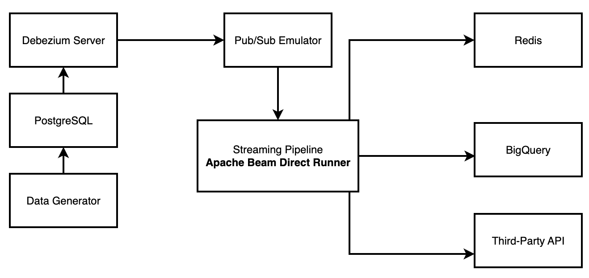

# Customer Engagement Pipeline

A real-time Change Data Capture (CDC) streaming pipeline that enriches engagement events with content metadata using PostgreSQL, Debezium Server, Google Cloud Pub/Sub Emulator, Apache Beam, BigQuery, and third-party API integration.
The pipeline is meant to run locally utilizing Docker and Python. However, an alternative on how the same pipeline can be implemented fully on Google Cloud is provided for reference, please see [Google Cloud Architecture](#google-cloud-architecture).

## Table of Contents

- [Architecture](#architecture)
  - [Components](#components)
- [Quick Start](#quick-start)
  - [Prerequisites](#prerequisites)
  - [1. Setup Environment](#1-setup-environment)
  - [2. Generate Test Data](#2-generate-test-data)
  - [3. Monitor the Pipeline](#3-monitor-the-pipeline)
- [Project Structure](#project-structure)
- [Configuration](#configuration)
  - [Environment Variables (environment.env)](#environment-variables-environmentenv)
  - [CDC Topics & Subscriptions](#cdc-topics--subscriptions)
  - [BigQuery Integration](#bigquery-integration)
  - [Pipeline Configuration](#pipeline-configuration)
- [Pipeline Features](#pipeline-features)
  - [Real-time Event Enrichment](#real-time-event-enrichment)
  - [Stateful Processing](#stateful-processing)
  - [Windowing Strategy](#windowing-strategy)
  - [Multiple Output Destinations](#multiple-output-destinations)
- [Monitoring & Debugging](#monitoring--debugging)
  - [View Pipeline Logs](#view-pipeline-logs)
  - [Redis Inspection](#redis-inspection)
  - [Database Inspection](#database-inspection)
  - [BigQuery Inspection](#bigquery-inspection)
  - [Third-Party API Testing](#third-party-api-testing)
- [Development](#development)
  - [Data Generation Options](#data-generation-options)
- [Troubleshooting](#troubleshooting)
  - [Common Issues](#common-issues)
  - [Reset Everything](#reset-everything)
- [Performance](#performance)
  - [Metrics](#metrics)
  - [Scaling Considerations](#scaling-considerations)
- [Third-Party API Integration](#third-party-api-integration)
- [Google Cloud Architecture](#google-cloud-architecture)

## Architecture




### Components

- **PostgreSQL**: Source database with logical replication enabled
- **Debezium Server**: Captures database changes and publishes to Pub/Sub
- **Pub/Sub Emulator**: Local Google Cloud Pub/Sub for development
- **Apache Beam**: Streaming pipeline for real-time event enrichment
- **Redis**: High-speed storage for enriched events with TTL
- **BigQuery**: Data warehouse for analytics and long-term storage
- **Third-Party API**: FastAPI simulation service for external integrations
- **Data Generator**: Utility for generating test data

## Quick Start

### Prerequisites

- Docker & Docker Compose
- Python 3.11+ (for local data generation)
- **Google Cloud Project with BigQuery enabled** (for full pipeline functionality)
  - The pipeline writes enriched events to BigQuery for analytics
  - BigQuery table must be created beforehand (see [BigQuery Integration](#bigquery-integration))
  - Update BigQuery project (BIGQUERY_PROJECT) variables in `.env` file in **Setup Environment** below
  - **Google Cloud CLI (gcloud) authentication required**

    #### Google Cloud Setup Instructions:

    ```bash
    # 1. Install Google Cloud CLI
    # macOS:
    brew install google-cloud-sdk

    # Ubuntu/Debian:
    sudo apt-get install google-cloud-cli

    # 2. Authenticate with Google Cloud
    gcloud auth login

    # 3. Set your default project
    gcloud config set project YOUR_PROJECT_ID

    # 4. Enable Application Default Credentials for local development
    gcloud auth application-default login

    # 5. Verify authentication
    gcloud auth list
    ```


> **💡 Note:** If you prefer to run the pipeline without BigQuery integration, you can comment out the BigQuery writer section in the pipeline code. See the [BigQuery Integration](#bigquery-integration) section for details on disabling this component.


### 1. Setup Environment

```bash
# Clone and navigate to project
git clone <repository-url>
cd customer-engagement-pipeline

# Setup environment variables
cp environment.env .env

# Start all services
docker compose up --build -d
```

This will automatically:
- Start PostgreSQL with CDC enabled
- Launch Pub/Sub emulator
- Set up topics and subscriptions (via init container)
- Start Debezium Server for CDC
- Launch the Apache Beam streaming pipeline
- Start Redis for high-speed data storage
- Start BigQuery integration (requires GCP credentials)
- Launch third-party API simulator

### 2. Generate Test Data

```bash
# Install Python dependencies for data generator
pip install faker psycopg2-binary

# Generate sample data - ex: 10 contnet and 200 engagement per minute for 10 minutes.
python3 data_generator.py --content 10 --engagement 200 --duration 10
```

### 3. Monitor the Pipeline

```bash
# View pipeline logs
docker compose logs -f beam-pipeline

# Check Redis data
docker exec redis redis-cli dbsize
docker exec redis redis-cli keys "eng:*"

# View enriched events in Redis
docker exec redis redis-cli get "eng:{content-id}:123"

# Check third-party API logs
docker compose logs -f third-party-api

# Monitor BigQuery integration (if configured)
# View enriched events in BigQuery console or using bq CLI
```

## Project Structure

```
customer-engagement-pipeline/
├── docker-compose.yaml           # Infrastructure orchestration
├── environment.env              # Environment variables template
├── seed.sql                     # Database schema
├── data_generator.py            # Test data generation utility
├── conf/
│   └── application.properties   # Debezium configuration
├── setup_pubsub/
│   ├── Dockerfile              # Pub/Sub setup init container
│   └── setup_pubsub.py         # Automated topic/subscription setup
├── bigquery/
│   ├── create_table.sql        # BigQuery table creation script
│   ├── enriched_events_schema.json # BigQuery schema definition
│   ├── insights.sql            # Sample analytical queries
│   └── README.md              # BigQuery setup documentation
├── third-party-api/
│   ├── Dockerfile              # FastAPI container
│   ├── main.py                # FastAPI application
│   └── requirements.txt        # API dependencies
└── pipeline/
    ├── Dockerfile              # Beam pipeline container
    ├── requirements.txt        # Python dependencies
    ├── config.py              # Configuration settings
    ├── streaming_new.py       # Main pipeline (refactored)
    ├── transforms/            # Apache Beam transforms
    │   ├── enrichment.py      # Stateful enrichment logic
    │   ├── redis_writer.py    # Redis output transform
    │   ├── http_sender.py     # Third-party API integration
    │   └── cache_logger.py    # Cache size logging
    └── utils/
        └── helpers.py         # Parsing and formatting utilities
```

## Configuration

### Environment Variables (environment.env)

Copy `environment.env` to `.env` and customize as needed


### CDC Topics & Subscriptions

Automatically created by the init container:

| Topic | Subscription | Purpose |
|-------|-------------|---------|
| `pgcdc.public.content` | `cdc-content-sub` | Content metadata changes |
| `pgcdc.public.engagement_events` | `cdc-engagement_events-sub` | User engagement events |


### BigQuery Integration

The pipeline includes full BigQuery integration for analytics and long-term storage. See [`bigquery/README.md`](./bigquery/README.md) for detailed setup instructions, schema information, and sample queries.

#### Disabling BigQuery Integration:

If you want to run the pipeline without BigQuery, you can disable it by commenting out the BigQuery writer in the pipeline code:

1. **Open** `pipeline/streaming_new.py`
2. **Find** the BigQuery writer section (search for `WriteToBigQuery` or similar)
3. **Comment out** the BigQuery write transform:
   ```python
       _ = (
        emitted
        | "WriteToBigQuery" >> beam.io.WriteToBigQuery(
            table=table_spec,
            schema=table_schema,
            create_disposition=beam.io.BigQueryDisposition.CREATE_IF_NEEDED,
            write_disposition=beam.io.BigQueryDisposition.WRITE_APPEND,
            method=beam.io.WriteToBigQuery.Method.STREAMING_INSERTS,
            insert_retry_strategy=beam.io.gcp.bigquery_tools.RetryStrategy.RETRY_ON_TRANSIENT_ERROR,
        )
    )
   ```

### Pipeline Configuration

Key settings in `pipeline/config.py`:

- **Database connection**: Auto-configured for Docker networking
- **Redis settings**: TTL (3600 seconds), connection parameters
- **Pub/Sub emulator**: Automatic host detection
- **Window timing**: 3-second emission intervals (configurable)
- **BigQuery integration**: Streaming inserts with schema validation
- **Third-party API**: HTTP timeout and retry configuration

## Pipeline Features

### Real-time Event Enrichment

The pipeline enriches engagement events with content metadata and derived fields:

**Content Metadata (from database):**
```json
{
  "id": "550e8400-e29b-41d4-a716-446655440000",
  "slug": "intro-to-apache-beam",
  "title": "Introduction to Apache Beam for Streaming Analytics",
  "content_type": "podcast",
  "length_seconds": 3600,
  "publish_ts": "2024-01-10T08:00:00Z"
}
```

**Input (Engagement Event):**
```json
{
  "id": 123,
  "content_id": "550e8400-e29b-41d4-a716-446655440000",
  "user_id": "6ba7b810-9dad-11d1-80b4-00c04fd430c8", 
  "event_type": "play",
  "event_ts": "2024-01-15T10:30:00Z",
  "duration_ms": 45000,
  "device": "web-firefox",
  "raw_payload": "{\"session_id\": \"abc123\", \"user_agent\": \"Mozilla/5.0...\"}"
}
```

**Output (Enriched Event):**
```json
{
  "id": 123,
  "content_id": "550e8400-e29b-41d4-a716-446655440000",
  "user_id": "6ba7b810-9dad-11d1-80b4-00c04fd430c8",
  "event_type": "play", 
  "event_ts": "2024-01-15T10:30:00Z",
  "duration_ms": 45000,
  "device": "web-firefox",
  "raw_payload": "{\"session_id\": \"abc123\", \"user_agent\": \"Mozilla/5.0...\"}",
  "content_type": "podcast",
  "length_seconds": 3600,
  "engagement_seconds": 45.0,
  "engagement_pct": 1.25
}
```

### Stateful Processing

- **Caching**: Content metadata cached in stateful DoFn
- **Late arrivals**: Engagement events buffered until content arrives
- **TTL handling**: Automatic cleanup of pending events

### Windowing Strategy

- **Global windows** with processing-time triggers
- **3-second emission intervals** for batch output (configurable)
- **Discarding accumulation** for real-time processing

### Multiple Output Destinations

- **Redis**: High-speed key-value storage with TTL for real-time access
- **BigQuery**: Data warehouse for analytics with streaming inserts
- **Third-Party API**: HTTP integration for external systems via FastAPI

## 🔍 Monitoring & Debugging

### View Pipeline Logs
```bash
# All services
docker compose logs -f

# Just the pipeline
docker compose logs -f beam-pipeline

# Debezium CDC logs
docker compose logs -f debezium-server

# Third-party API logs
docker compose logs -f third-party-api
```

### Redis Inspection
```bash
# Connect to Redis CLI
docker exec -it redis redis-cli

# Key patterns
KEYS "eng:*"              # All enriched events
DBSIZE                    # Total key count
GET "eng:{content-id}:123" # Specific event
```

### Database Inspection
```bash
# Connect to PostgreSQL
docker exec -it postgres psql -U debezium -d users_data

# Check tables
\dt
SELECT COUNT(*) FROM content;
SELECT COUNT(*) FROM engagement_events;
```

### BigQuery Inspection
```bash
# Connect to BigQuery (requires gcloud CLI and authentication)
bq ls ${BIGQUERY_PROJECT}:${BIGQUERY_DATASET}

# Check table data
bq query --use_legacy_sql=false \
  "SELECT COUNT(*) as total_events FROM \`${BIGQUERY_PROJECT}.${BIGQUERY_DATASET}.${BIGQUERY_TABLE}\`"

# View recent enriched events
bq query --use_legacy_sql=false \
  "SELECT * FROM \`${BIGQUERY_PROJECT}.${BIGQUERY_DATASET}.${BIGQUERY_TABLE}\` 
   ORDER BY event_ts DESC LIMIT 10"
```

### Third-Party API Testing
```bash
# Health check
curl http://localhost:${THIRD_PARTY_API_PORT}/

# Check API stats
curl http://localhost:${THIRD_PARTY_API_PORT}/stats

# Send test event batch
curl -X POST http://localhost:${THIRD_PARTY_API_PORT}/events \
  -H "Content-Type: application/json" \
  -d '{"events": [{"id": 1, "content_id": "test", "event_type": "play"}]}'
```

## Development

### Data Generation Options

```bash
# Generate content and engagement events
python3 data_generator.py --content 5 --engagement 50

# Generate engagement for existing content only
python3 data_generator.py --engagement 100 --use-existing

# Continuous generation
python3 data_generator.py --content 10 --engagement 50 --duration 300
```

## Troubleshooting

### Common Issues

**Pipeline not starting:**
- Check if Pub/Sub subscriptions exist: `docker compose logs pubsub-init`
- Verify Debezium is connected: `docker compose logs debezium-server`

**No enriched events:**
- Generate both content AND engagement events
- Check pipeline logs for enrichment activity
- Verify Redis connectivity
- Check BigQuery integration (authentication, project permissions)
- Verify third-party API connectivity

**CDC not working:**
- Ensure PostgreSQL logical replication is enabled
- Check Debezium configuration in `conf/application.properties`
- Verify database permissions for `debezium` user

### Reset Everything

```bash
# Stop and remove all containers, networks, volumes
docker compose down -v

# Rebuild and restart
docker compose up --build
```

## 📊 Performance

### Metrics

The pipeline tracks:
- **Enrichment success/failure rates**
- **Cache hit/miss ratios** 
- **Redis write performance**
- **Content cache size**
- **BigQuery streaming insert success/failures**
- **Third-party API response times and error rates**

### Scaling Considerations

- **Horizontal scaling**: Multiple pipeline instances with Dataflow
- **Vertical scaling**: Increase container resources
- **Redis clustering**: For high-throughput scenarios
- **Pub/Sub partitioning**: For parallel processing
- **BigQuery streaming quotas**: Monitor streaming insert limits
- **Third-party API rate limiting**: Implement backoff and retry logic


## Third-Party API Integration

The pipeline includes a FastAPI-based simulation service that demonstrates how to integrate with external systems. The service:

- **Receives enriched events** via HTTP POST
- **Logs all interactions** for debugging and monitoring
- **Provides health checks** and basic statistics
- **Supports batch processing** for efficient data transfer

## Google Cloud Architecture


